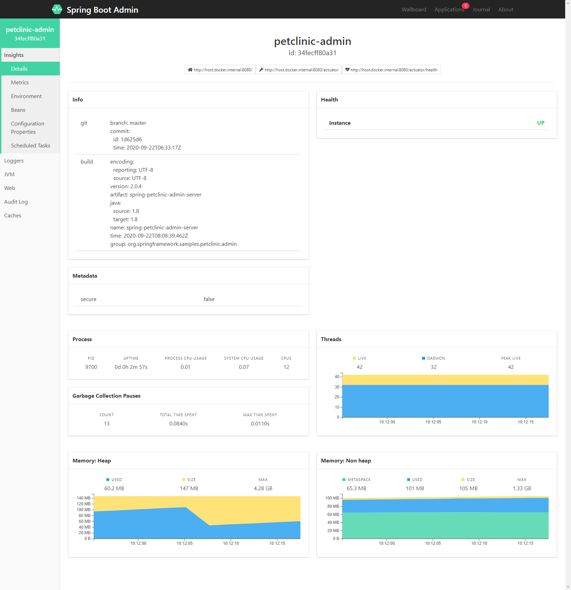

# EXPOSER DES APPLICATIONS

L’objectif de ce TP est de mettre en place une infrastructure pour exposer une application.

----

{:toc}


## Les éléments de notation
Envoyer par email les éléments suivant : 

* fichier de configuration, a mettre dans votre repository git
* Réponse au [qcm](https://docs.google.com/forms/d/1mZa3mEjxPy7gEFswc6Ok3iAAr79FHaIW_fIWUd7Idsk)

## Installer les composants 

La **première étape** consiste a installer le serveur de configuration et d'enregistrement des services

1. Télécharger consul [ici](https://www.consul.io/downloads.html)
2. Installer consul, il suffit de decompresser l'archive
3. Démarrer consul
   ```bash
   ./consul agent -dev -node machine
   ```
4. Visualiser la console consul : http://localhost:8500/ui

La capture d'écran montre aussi le composant suivant

## Préparation de l'application

La **deuxième étape** est de compiler les applications exemples :

1. Penser au java 8
2. Générer les binaires
   ```bash
   git clone https://github.com/diogene/Infrastructure-de-production.git
   cd Infrastructure-de-production/codes
   mvn clean install
   ```
## Installer la console d'administration
La console d'administration va nous permettre de visualisation les modifications faite dans l'application

1. lancer la console d'administration :
   ```bash
   java -jar spring-petclinic-admin-server/target/spring-petclinic-admin-server-2.0.4.jar
   ```
2. tester [spring boot admin](http://localhost:8080 )
   L'interface d'administration ne propose pas tous les menus en raison de restriction de sécurité.
   


## Modification de notre application pour le cloud
1. Lancer l'application de test
   ```bash
   /usr/lib/jvm/java-8-openjdk-amd64/bin/java -jar spring-petclinic-visits-service/target/spring-petclinic-visits-service-2.0.4.jar
   ```
2. Tester le fonctionnement avec : http://localhost:[votre port]/owners/*/pets/8/visits
3. Ajouter les dépendances spring. A mettre au bon niveau.
   ```xml 
   pom.xml
   <dependency>
       <groupId>org.springframework.boot</groupId>
       <artifactId>spring-boot-starter-actuator</artifactId>
   </dependency>
    
    
   <dependency>
       <groupId>org.springframework.cloud</groupId>
       <artifactId>spring-cloud-starter-consul-all</artifactId>
   </dependency>
   ```
4. Modifier la classe de démarrage
   ```java
   import org.springframework.cloud.client.discovery.EnableDiscoveryClient;
    
   @SpringBootApplication
   @EnableDiscoveryClient
   public class VisitsServiceApplication {
       ...
   }
   ```
5. localiser le fichiers bootstrap.yml
   ```yml
   bootstrap.yml
   spring:
     cloud:
       consul:
         host: localhost
         port: 8500
         config:
           enabled: true
           fail-fast: true
           format: yaml
     application:
       name: petclinic-visits
   ```
5. Redémarrer
6. L'application doit maintenant être enregistré et visible dans la console consul


## Ajouter tous les menus
La console d'administration ne propose pas tous les menus en raison de limitation de sécurité. Nous allons ajouter ces informations dans la partie configuration de consul.


Pour avoir accès a tous les menus il faut configurer l’application avec le paramètre : 
   ```properties
   management.endpoints.web.exposure.include=*
   management.endpoint.health.show-details=always
   ```

### Pour la console d'administration

dans consul, il est possible d'ajouter des éléments de configuration. Ajout de ce paramètre dans le serveur de configuration. 

1. Créer une entrée config/petclinic-admin/data avec la valeur. Cette ajout doit être fait depuis l'application consul. Par defaut spring-config va chercher les valeurs dans la clé data. Il est possible de configurer une autre clé avec la configuration `spring.cloud.consul.config.prefix-data`
   ```yml
   management:
      endpoints:
         web:
            exposure:
               include: '*'
         health:
            show-details: always
   ```
2. Redémarrer le serveur. Les possibilités d'administration doivent être augmentées


### pour les services
Pour ce service on va mettre plus de données

1. Créer une entrée **config/petclinic-visits/data** avec l'interface de consul et ajouter la valeur
   ```yml
   server:
   port: 0
   spring:
   cloud:
      consul:
         discovery:
         instanceId: ${spring.application.name}:${vcap.application.instance_id:${spring.application.instance_id:${random.value}}}
   ```
2. La consultation ne change pas ! C'est normal car les endpoints actuator, qui est le module spring d'administration, désactive par defaut tous les services
3. mettre dans consul
   ```yml
   management:
      endpoints:
         web:
            exposure:
               include: metrics, health
         health:
            show-details: always
   ```


   ## Utilisation de ribbon

1. dans le projet `spring-petclinic-customers-service` ajouter le service discovery
2. dans le projet `spring-petclinic-customers-service` ajouter l'enregistrement dans springboot admin
3. dans le projet `spring-petclinic-customers-service` mettre `spring-petclinic-visits-service` en dépendance
4. dans le projet `spring-petclinic-customers-service` ajouter la dependance `ribbon` 
   ```xml
   <dependency>
      <groupId>org.springframework.cloud</groupId>
      <artifactId>spring-cloud-starter-ribbon</artifactId>
   </dependency>
   ```
5. dans le projet `spring-petclinic-customers-service`, le service `@GetMapping("owners/*/pets/{petId}")` appeler le service `@GetMapping("owners/*/pets/{petId}/visits")` qui se trouve dans le projet `spring-petclinic-visits-service`
6. dans le projet 

   ```java
   @LoadBalanced
   @Bean
   public RestTemplate loadbalancedRestTemplate() {
      new RestTemplate();
   }
   ```

7. dans la classe `PetResource` ajouter le chargement du nouveau restTemplate,
   ```java
   @Autowired
   RestTemplate restTemplate;


   public PetDetails findPet(@PathVariable("petId") int petId) {
      
      List<Visit> visits =  this.restTemplate.getForObject("https://petclinic-visits/owners/*/pets/" + petId, String.class);

      return new PetDetails(findPetById(petId), visits);
   }
   ```
