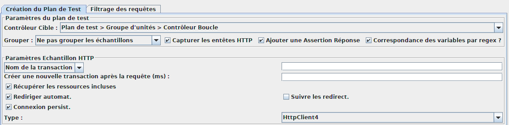
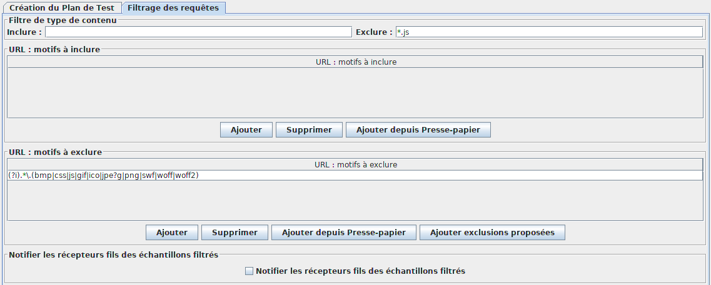
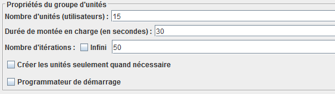
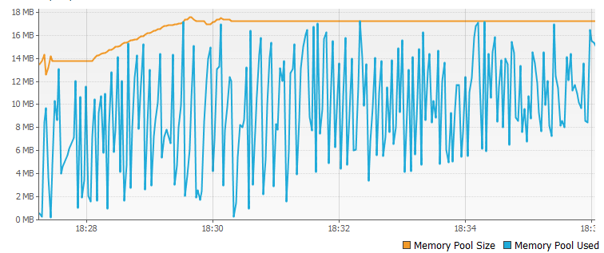

# MONITORER UNE APPLICATION

L’objectif de ce TP est d'effectuer un test de performance (robustesse) et de diagnostiquer une erreur sur l'application petclinic. Ce TP peut être réalisé sous windows ou sous Docker si ce dernier fonctionne. Tous les outils doivent être lancé en tant qu'administrateur pour fonctionner


## Les éléments de notation

* fichier de configuration, a mettre dans votre repository git
* Réponse au [qcm](https://docs.google.com/forms/d/1qWzqM2oUiqYcAt3YHMw7-SLUKEKG14GWIxlhrMYrOgI)

## Préparation du test de performance
### Installation

Pour réaliser ce test il faut :
1. Un machine virtuel java
2. Un tomcat installé
3. Jmeter, téléchargeable à l'adresse [ici](http://jmeter.apache.org/download_jmeter.cgi)

### Préparation du diagnostic

Pour le diagnostic les outils nécessaires sont :

1. une machine virtuel java, presque tous les outils sont fourni avec
2. Des plugins pour [VisualVM](https://visualvm.github.io/download.html) (Tools > plugins)
    
3. Installer les plugins visualGC, ThreadInspector, Tracer monitor probes
4. MAT (Memory Analiser Tools) téléchargeable [ici](http://www.eclipse.org/mat/downloads.php)

### Déployer l'application Exemple

Il y a deux possibilités pour réaliser le test de performance. La première possibilitée est de tous faire dans windows avec un tomcat installé en local et jmeter aussi. La seconde est d'utiliser linux.

1. Installer tomcat et télécharger le war (petclinic.war) et installé le dans le répertoire webapps
2. Vérifier la quantité de mémoire (-Xms, -Xmx) alloué pour le processus java dans le fichier catalina (variable `JAVA_OPTS` ou `CATALINA_OPTS` et mettre -Xmx64m) et mettre le dump memoire lors du out of memoty (`-XX:+HeapDumpOnOutOfMemoryError` `-XX:HeapDumpPath=/tmp/dump`)
3. Démarrer l'application

sous linux,

1. Installer l'image tomcat car elle est foruni avec la jdk et non la jre comme les images officielles :
   ```bash
   docker pull tomcat:8.5-jdk8-slim
   ```
2. lancer la machine docker, les éléments de lancement sont :
   1. `JAVA_OPTS="-Xmx64M -XX:+HeapDumpOnOutOfMemoryError -XX:HeapDumpPath=/usr/local/tomcat/temp"`
   2. `CATALINA_OPTS="-Dcom.sun.management.jmxremote.port=8090 -Dcom.sun.management.jmxremote.rmi.port=8091 -Dcom.sun.management.jmxremote.authenticate=false -Dcom.sun.management.jmxremote.ssl=false -Dcom.sun.management.jmxremote.local.only=false -Djava.rmi.server.hostname=[mettre l'ip du host docker]"`
   3. utiliser le war fourni
   4. Le tomcat est installé dans `/usr/local/tomcat`

### Visualiser la mémoire et le garbage collector

Avec VisualVM consulter les informations concernant la JVM. L'url de connection JMX est de la forme `service:jmx:rmi:///jndi/rmi://10.0.75.1:8090/jmxrmi`

### Créer le scénario de test
1. Pour avoir jmeter en francais :
   ```bash
   export JMETER_LANGUAGE="-Duser.language=fr -Duser.region=FR
   ```
2. Lancer jmeter avec la commande `/bin/jmeter.(sh|bat)` selon votre environnement pour avoir :
   
    Le scenarii a effectuer :
        - Rechercher tous les propriétaires d'animaux
        - Après le résultat retournez sur la page de recherche
        - Ajoutez un nouveau propriétaire
        - Ajoutez un nouvel animal a ce propriétaire
        - Retournez sur la page de rechercher et recherchez tous les propriétaires
3. La première étape est de mettre en place l'enregistrement de votre scénario
pour vous aider : https://jmeter.apache.org/usermanual/jmeter_proxy_step_by_step.html
   
     
   Attention, penser a supprimer les informations de localhost et de 127.0.0.1 dans la configuration du proxy
     
4. Ensuite il faut jouer le scénario pour enregistrer toutes les pages
5. Variabiliser le nom du propriétaire ( ${__RandomString(10,ABCDEFGHIJKLMNOPQRSTUVWXYZabcdefghijklmnopqrstuvwxyz0123456789,)} )
   
6. Extraire l'identifiant du nouveau propriétaire
   
7. Lancer un tir de performances
   
8. Lancer un premier tir avec 50 itération et un second en infini
   
   L'eden grossit et possède de plus en plus d'objet
9.  Les tests ne doivent pas fonctionner. vous avez l'erreur :
   ```bash
   Exception: java.lang.OutOfMemoryError thrown from the UncaughtExceptionHandler in thread "RMI TCP Connection(idle)"
    java.lang.OutOfMemoryError: GC overhead limit exceeded
    Exception in thread "RMI TCP Connection(idle)" java.lang.OutOfMemoryError: GC overhead limit exceeded
   ```
11. Effectuer un heapdump de la mémoire pour analyse si le dump n'a pas été fait automatiquement
   ```bash
   docker exec -it [identifiant de votre docker] su -m root -c '/usr/local/openjdk-8/bin/jmap -dump:format=b,file=/usr/local/tomcat/temp/heapDump.hprof 1'
   ```
11. Récupérer le heap dump
   ```bash
   docker cp [identifiant de votre docker]:/usr/local/tomcat/temp/heapDump.hprof .
   ```
12. Faite la même chose avec un threaddump. La commande java est :
   ```bash
   jstack [PID du tomcat] > /usr/local/tomcat/temp/threadDump.tdump
   ```
13. La commande pour connaitre le PID d'un processus sous linux (commande pour ps dans docker tomcat apt-get update && apt-get install procps)
   ```bash
   ps -ef | grep java | awk '{print $1}'
   ```
14. Analyser le dump et trouvez la cause de la fuite de mémoire
15. Rechercher dans le [source](./spring-framework-petclinic-master.7z) l'erreur