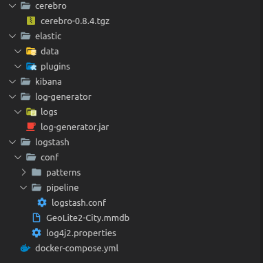

# SUIVI DES LOGS

L’objectif de ce TP est de mettre en place une infrastructure pour suivre en temps réel les logs des applications. Ce TP doit être réalisé uniquement sous Docker .


## Les éléments de notation

* fichier de configuration, a mettre dans votre repository git
* Réponse au [qcm](https://docs.google.com/forms/d/11AR2u_pmATVlzOvOcdh_lP7Yx-S0ORKtD9p21kLYIJQ)

## Préparation du test de performance
### Installation

Le générateur de log et les données de géolocalisation sont issus d'un workshop donné par xebia : https://github.com/xebia-france/workshop-kibana

1. télécharger Logstash
  ```bash
  docker pull docker.elastic.co/logstash/logstash:7.9.2
  ```
2. installer Elasticsearch 
  ```bash
  docker pull docker.elastic.co/elasticsearch/elasticsearch:7.9.2
  ```
3. télécharger Kibana
  ```bash
  docker pull docker.elastic.co/kibana/kibana:7.9.2
  ```
4. télécharger le générateur de log, [log-generator.jar](log-generator.jar)
5. télécharger les données de géolocalisation, [GeoLite2-City.mmdb.gz](GeoLite2-City.mmdb.gz)
6. télécharger la dernière release de [cerebro](https://github.com/lmenezes/cerebro/releases)

## Configuration des composants
### démarrer les composants 

L'arborescence à mettre en œuvre pour ce TP :



Pour tous vos travaux vous utiliserez les liens (link) pour autoriser les communications entre les différents containers. le demarrage de l'infrastructure est fait via les docker-compose

La partie du docker compose pour lancer elasticsearch est :

```yml
  elasticsearch:
      image: docker.elastic.co/elasticsearch/elasticsearch:7.9.2
      container_name: elasticsearch
      environment:
          - cluster.name=docker-cluster
          - bootstrap.memory_lock=true
          - discovery.type=single-node
          - "ES_JAVA_OPTS=-Xms512m -Xmx512m"
      volumes:
          - esdata1:/usr/share/elasticsearch/data
      ports:
          - 9200:9200
          - 9300:9300
```

Démarrer logstash :

```yml
  logstash:
      image: docker.elastic.co/logstash/logstash:7.9.2
      expose:
          - "5000"
      ports:
          - "5000:5000"
      links:
          - elasticsearch:elasticsearch
      volumes:
          - c:/Users/dioge/OneDrive/Documents/personnel/cours/cours/TP5/logstash/conf/pipeline/:/usr/share/logstash/pipeline/
          - c:/Users/dioge/OneDrive/Documents/personnel/cours/cours/TP5/logstash/conf/:/usr/share/logstash/config/ 
      command: logstash -f config/ventes.conf --verbose --log.level debug --config.reload.automatic
```

- Le fichier [log4j2](log4j2.properties) et ajouter un fichier logstash.conf avec la configuration par defaut.
- le fichier ventes.conf est a créer par vos soin et a mettre dans le répertoire `conf` 

```
  input {
      tcp {
          port => 5000
      }
  }
  filter {}
  output {
      stdout { 
        codec => rubydebug{metadata =>  true } 
      }
  }
```

Démarrage de kibana :
```yml
kibana:
    image: docker.elastic.co/kibana/kibana:7.9.2
    environment:
       - ELASTICSEARCH_HOSTS=http://elasticsearch:9200
    ports:
        - "5601:5601"
```

> :no_entry_sign:  Les urls ne sont pas a change

les port correspondent à :

    - 5000: Logstash TCP input
    - 9200: Elasticsearch HTTP
    - 9300: Elasticsearch TCP transport
    - 5601: Kibana

1. Ecrire les lignes de commande docker run de chaque composant
2. Ecrire le docker-compose de lancement des composants (elasticsearch, logstash, kibana)

> :warning: Attention aux droits de vos répertoires
> 
> :warning: Attention a l'utilisation des ports sur votre machine

Pour toutes les lignes de commande et pour toutes les références entre serveurs, il faut utiliser les alias à la place des ip et/ou host

pour stopper tous les containers 
```bash
docker rm -f $(docker ps -a -q)
```

si vous souhaitez avoir des informations sur la santé et les index de elasticsearch :

Démarrage de cerebro :

```yml
  cerebro:
      image: openjdk:8-alpine
      volumes:
          - c:/Users/dioge/OneDrive/Documents/personnel/cours/cours/TP5/cerebro:/usr/src/cerebro:ro
      links:
          - elasticsearch:elasticsearch
      ports:
      - "9000:9000"
      command: "/bin/sh -c 'cp -r /usr/src/cerebro/cerebro-0.7.0.tgz /tmp/cerebro-0.7.0.tgz; tar -xvf /tmp/cerebro-0.7.0.tgz; /cerebro-0.7.0/bin/cerebro '"
      
```

Il est aussi possible de démarrer cerebro directement depuis votre poste.


### Configuration et lancer logstash

l'objectif de cette section est de mettre en forme les données pour qu'les puissent etre utilisable dans elastic

* Créer un fichier de configuration (logstash.conf) dans le répertoire conf
* Copier le fichier d'information de géolocalisation dans le répertoire conf
* Créer un répertoire patterns dans la conf

* Ajouter une entrée dans logstash.conf
  ```
    input {
        tcp {
            port => 5000
        }
    }
  ```
* ajouter la zone de filtre dans logstash.conf
  ```
    filter {
     
    }
  ```
* configurer la sortie vers ES dans logstash.conf
  ```
    output {
        elasticsearch {
            hosts => "elasticsearch:9200"
        }
    }
  ```
* Lancer le générateur de log pour valoriser ES
  ```bash
    Usage: <main class> [options]
    Options:
            --help
        Default: false
    * -logs, -n
        Number of logs to generate
        -repeat, -r
        Repeat every N milliseconds
        Default: 0
        -threads, -t
        Number of threads to use
        Default: 1
    
    java -jar log-generator.jar -n 5000 -r 1500 | nc 192.168.0.12 5000
    ```
    sous Windows il est possible de lancer [netcat-win32](https://eternallybored.org/misc/netcat/netcat-win32-1.11.zip)
    ```̀bash
    java -jar log-generator.jar -n 500 -r 1500 | netcat-1.11\nc64 192.168.0.12 5000
    ```
    Le log généré est 

    ```bash
    11-11-2016 16:28:24.508 [pool-1-thread-1] INFO com.github.vspiewak.loggenerator.SearchRequest - id=27,ip=90.84.144.93,category=Portable,brand=Apple
    11-11-2016 16:28:24.525 [pool-1-thread-1] INFO com.github.vspiewak.loggenerator.SellRequest - id=28,ip=92.90.16.190,email=client29@gmail.com,sex=M,brand=Apple,name=iPhone 5C,model=iPhone 5C - Jaune - Disque 32Go,category=Mobile,color=Jaune,options=Disque 32Go,price=699.0
    11-11-2016 16:28:24.540 [pool-1-thread-1] INFO com.github.vspiewak.loggenerator.SearchRequest - id=29,ip=93.31.186.100,category=Portable
    11-11-2016 16:28:24.549 [pool-1-thread-1] INFO com.github.vspiewak.loggenerator.SearchRequest - id=30,ip=109.211.12.248,category=Baladeur,brand=Apple,color=Argent,options=Disque 16Go
    11-11-2016 16:28:24.557 [pool-1-thread-1] INFO com.github.vspiewak.loggenerator.SellRequest - id=31,ip=86.73.160.167,email=client32@gmail.com,sex=M,brand=Apple,name=iPad mini,model=iPad mini - Blanc,category=Tablette,color
```

* Consulter les logs générés sous kibana (http://192.168.0.12:5601/)
  la forme doit être du type
    ```json
    {
    "_index": "logstash-2016.11.11",
    "_type": "logs",
    "_id": "AVhUJpEVMJugJY_jEVP5",
    "_score": null,
    "_source": {
        "@timestamp": "2016-11-11T16:09:22.450Z",
        "geoip": {},
        "port": 38968,
        "@version": "1",
        "host": "172.17.0.1",
        "message": "11-11-2016 17:08:51.558 [pool-1-thread-2] INFO com.github.vspiewak.loggenerator.SearchRequest - id=3770,ip=81.251.86.65,category=Baladeur,color=Jaune,options=Disque 32Go\r",
        "tags": [
        "_geoip_lookup_failure"
        ]
    },
    "fields": {
        "@timestamp": [
        1478880562450
        ]
    },
    "sort": [
        1478880562450
    ]
    }
  ```

Les logs sous cette forme ne sont pas exploitables. Il faut effectuer des traitements dans le filtre de logstash pour les mettre en forme.

* Parse de la log pour extraire les données

```
grok {
     patterns_dir => ["/usr/share/logstash/patterns"]
     match => ["message","%{LOG_DATE:log_date} \[%{NOTSPACE:thread}\] %{LOGLEVEL:log_level} %{NOTSPACE:classname} - %{GREEDYDATA:msg}"]
}
```
LOG_DATE est un pattern (téléchargeable [ici](custom)) spécifique qui permet d'extraite la date de la log, avec la mise a jour du lancement de logstash

```yml
volumes:
    - /home/etud/diogene.moulron/elastic/logstash/conf/patterns:/usr/share/logstash/patterns
```

* La nouvelle forme de la log est 
  ```json
  {
    "_index": "logstash-2014.11.03",
    "_type": "logs",
    "_id": "i8UgsVDbR6-ZZ4LP4Y3TWw",
    "_score": null,
    "_source": {
      "message": "03-11-2014 14:12:59.999 [pool-34-thread-2] INFO com.github.vspiewak.loggenerator.SellRequest - id=166099&ua=Mozilla/5.0 (Windows NT 5.1; rv:2.0.1) Gecko/20100101 Firefox/4.0.1&ip=94.228.34.210&email=client100@gmail.com&sex=M&brand=Apple&name=iPod Touch&model=iPod Touch - Violet - Disque 64Go&category=Baladeur&color=Violet&options=Disque 64Go&price=449.0\r",
      "@version": "1",
      "@timestamp": "2014-11-03T13:13:00.245Z",
      "host": "FRO9272454D",
      "path": "D:\\etudes\\Cours\\ELK\\logstash-1.4.2\\bin\\app.log",
      "log_date": "03-11-2014 14:12:59.999",
      "thread": "pool-34-thread-2",
      "log_level": "INFO",
      "classname": "com.github.vspiewak.loggenerator.SellRequest",
      "msg": "id=166099&ua=Mozilla/5.0 (Windows NT 5.1; rv:2.0.1) Gecko/20100101 Firefox/4.0.1&ip=94.228.34.210&email=client100@gmail.com&sex=M&brand=Apple&name=iPod Touch&model=iPod Touch - Violet - Disque 64Go&category=Baladeur&color=Violet&options=Disque 64Go&price=449.0\r"
    }
  }  
  ```

Entre chaque modification logstash la recharge.

Pour visualiser les erreurs :
```bash
docker logs -f  infraprod_logstash_1
```

## Visualisation des composants
### Visualiser sous kibana

Dans la section filtre vous devez ajouter différents elements pour une meilleure exploitabilité

* Extraire les données de la requête (id=60,ip=80.78.9.34,brand=Apple,name=iPhone 5C,model=iPhone 5C - Vert - Disque 32Go,category=Mobile,color=Vert,options=Disque 32Go,price=699.0)
  Utilisation du filtre [kv](https://www.elastic.co/guide/en/logstash/current/plugins-filters-kv.html)
* Tagger les requêtes en sell ou search (com.github.vspiewak.loggenerator.SearchRequest ou com.github.vspiewak.loggenerator.SellRequest)
  Utilisation d'une combinaison de [mutate et de add_tag](https://www.elastic.co/guide/en/logstash/current/plugins-filters-mutate.html#plugins-filters-mutate-add_tag) en conjonction avec du [conditionnel](https://www.elastic.co/guide/en/logstash/current/event-dependent-configuration.html#conditionals).
* Ajouter les informations de géolocalisation dans le fichier de conf logstash
  ```
  geoip {
      source => "ip"
      database => "/usr/share/logstash/config/GeoLite2-City.mmdb"
  }
* Conversion des informations de prix en number
  utilisation du filtre [mutate et convert](https://www.elastic.co/guide/en/logstash/current/plugins-filters-mutate.html#plugins-filters-mutate-convert)
* Extraction des options 
  utilisation du filtre [mutate et split](https://www.elastic.co/guide/en/logstash/current/plugins-filters-mutate.html#plugins-filters-mutate-split)

## Logs exploitable

Le nouveau format des logs est plus exploitable maintenant

```json
{
  "_index": "logstash-2014.11.03",
  "_type": "logs",
  "_id": "4tqUHrG6TsOkDFC5AV3Nrg",
  "_score": null,
  "_source": {
    "message": "03-11-2014 14:35:59.916 [pool-21-thread-2] INFO com.github.vspiewak.loggenerator.SellRequest - id=20411&ua=Mozilla/5.0 (X11; Linux x86_64; rv:2.0) Gecko/20100101 Firefox/4.0&ip=80.215.33.111&email=client412@gmail.com&sex=M&brand=Google&name=Nexus 4&model=Nexus 4 - Noir - Disque 16Go&category=Mobile&color=Noir&options=Disque 16Go&price=199.0\r",
    "@version": "1",
    "@timestamp": "2014-11-03T13:35:59.916Z",
    "host": "FRO9272454D",
    "path": "D:\\etudes\\Cours\\ELK\\logstash-1.4.2\\bin\\app.log",
    "log_date": "03-11-2014 14:35:59.916",
    "thread": "pool-21-thread-2",
    "log_level": "INFO",
    "classname": "com.github.vspiewak.loggenerator.SellRequest",
    "msg": "id=20411&ua=Mozilla/5.0 (X11; Linux x86_64; rv:2.0) Gecko/20100101 Firefox/4.0&ip=80.215.33.111&email=client412@gmail.com&sex=M&brand=Google&name=Nexus 4&model=Nexus 4 - Noir - Disque 16Go&category=Mobile&color=Noir&options=Disque 16Go&price=199.0\r",
    "tags": [
      "sell"
    ],
    "id": 20411,
    "ua": "Mozilla/5.0 (X11; Linux x86_64; rv:2.0) Gecko/20100101 Firefox/4.0",
    "ip": "80.215.33.111",
    "email": "client412@gmail.com",
    "sex": "M",
    "brand": "Google",
    "name": "Nexus 4",
    "model": "Nexus 4 - Noir - Disque 16Go",
    "category": "Mobile",
    "color": "Noir",
    "options": [
      "Disque 16Go"
    ],
    "price": 199,
    "geoip": {
      "ip": "80.215.33.111",
      "country_code2": "FR",
      "country_code3": "FRA",
      "country_name": "France",
      "continent_code": "EU",
      "latitude": 48.860000000000014,
      "longitude": 2.3499999999999943,
      "timezone": "Europe/Paris",
      "location": [
        2.3499999999999943,
        48.860000000000014
      ]
    }
  }
}
```

## Création d'un dashboard métier

### ajout de l'index dans kibana

Pour commencer a faire des recherches et des visualisation il faut créer un `index pattern` dans kibana. pour ce faire :

1. selection de l'index a créer dans kibana
  

2. défintion du pattern (logstash-*) a mettre en oeuvre 
  

3. configuration du pattern en selectionnant le timestamp 
  

### creation de la recherche

La préparation consiste en la création de query préparées :

1 dans la zone de recherche, ajoutez :
  tags:search
  tags:sell
  sex:M
  sex:F

### Ajout des widgets

1. Répartition des ventes selon le sexe

pour toute les étapes de création d'une visualisation il faut :
1. Selection le module de création de visualisation 
  
2. Selection le type de visualisation 
  
3. Configurer la visualisation 
  
  Chaque visualisation a sa propre configuration et dépend du type de données a manipuler


1. Ajout d'un widget de localisation des ventes
Le widget s'appelle Tile map.
  
  

2. Ajout d'un widget Vertical Bar
Ajouter un widget vertical bar pour mettre les types de ventes (Catégories) sur la période

3. Ajout d'un widget sur le montant total des ventes 
Ajouter un widget Line pour sommer les ventes sur la période

3. Ajouter un camembert donnant le nombre de vente par modèle

### création du tableau de bord

Pour ceux qui ont le plus avancé, vous pouvez faire un tableau de bord