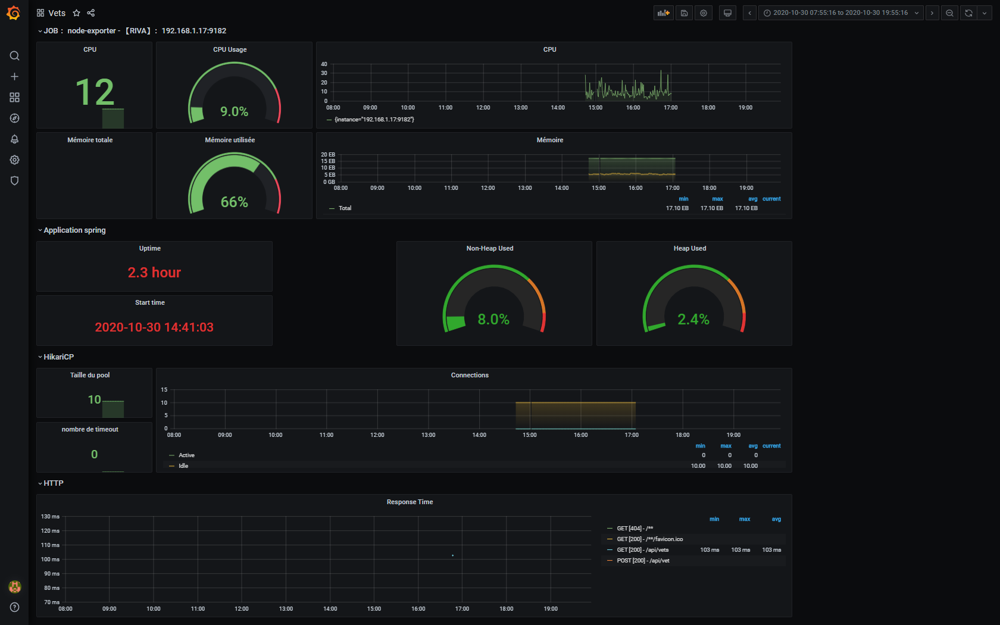

# MONITORER UNE APPLICATION

L’objectif de ce TP est d'installer et d'utiliser les outils de monitoring sur l'application petclinic. Ce TP doit être réalisé uniquement sous Docker.


## Les éléments de notation

* fichier de configuration, a mettre dans votre repository git
* Réponse au [qcm](https://goo.gl/forms/fIeyAOnHTP2FDA7c2)


## La mise en place des composants
### Monitoring docker

[CAdvisor](https://github.com/google/cadvisor)

cAdvisor est un outil de monitoring des containers docker. Il se lance lui même dans un container.

  ```bash
    docker run --publish=8080:8080 --detach=true --name=cadvisor  google/cadvisor-canary:latest
  ```

Selon les systèmes les volumes peuvent ne pas être montés. Une fois le container démarrer il est testable a l'adresse : http://<votre ip>:8080 :


### Monitoring système linux

[container-exporter](https://github.com/prometheus/node_exporter)

Pour un bon monitoring il faut ajouter les metric du système qui héberge les container docker. Il faut mettre en œuvre des agents qui exportent ces metric vers Prometheus. Il existe un agent pour docker :

  ```bash
docker run
  -v /proc:/host/proc -v /sys:/host/sys -v /:/rootfs                 \
  --detach=true                                                      \
  --publish=9100:9100                                                \
  --name=node-exporter                                               \
quay.io/prometheus/node-exporter                                     \
--path.procfs /host/proc --path.sysfs /host/sys --collector.filesystem.ignored-mount-points "^/(sys|proc|dev|host|etc)($|/)"
  ```

Une fois le container démarrer il est testable a l'adresse : http://<votre ip>:9100/metrics :


### monitoring systems windows

[windows_exporter}(https://github.com/prometheus-community/windows_exporter)

télécharger la dernière [release] (https://github.com/prometheus-community/windows_exporter/releases/download/v0.14.0/windows_exporter-0.14.0-386.exe)

le lancement :
```bash 
.\windows_exporter-0.14.0-386.exe
```

les métriques prometheus sont disponible a l'adresse http://<votre ip>:9182/metrics

### Monitoring applicatif

Pour avoir des données pour notre test il faut installer une application. Télécharger et installer sous docker l'aplication du TP2 en springboot. desactiver l'utilisation de consul et ajouter les elements suivants.

> :information_source:  Le module a utiliser est vets

#### Modifier l'application

ajouter les jar de prometheus dans l’application :

```xml
<!-- Spring boot actuator to expose metrics endpoint -->
<dependency>
    <groupId>org.springframework.boot</groupId>
    <artifactId>spring-boot-starter-actuator</artifactId>
</dependency>
<!-- Micormeter core dependecy  -->
<dependency>
    <groupId>io.micrometer</groupId>
    <artifactId>micrometer-core</artifactId>
</dependency>
<!-- Micrometer Prometheus registry  -->
<dependency>
    <groupId>io.micrometer</groupId>
    <artifactId>micrometer-registry-prometheus</artifactId>
</dependency>
```
Ajouter l'export des metrics java pour prometheus dans le fichier application.properties :

```properties
#Metrics related configurations
management.endpoint.metrics.enabled=true
management.endpoints.web.exposure.include=*
management.endpoint.prometheus.enabled=true
management.metrics.export.prometheus.enabled=true
```

Il n'y a plus qu'a compiler
```bash
./mvnw clean install -Dmaven.test.skip=true
```

#### Exécuter l'application
les éléments pour lancer l'application petclinic en docker est :
```bash
Port exposé : 8888
nom du container : springboot
nom de l'image : openjdk. par defaut c'est l'image latest qui est chargé
ligne de commande de lancement : bash -c bash -c 'java -jar /usr/share/petclinic/spring-petclinic-vets-service-2.0.4.jar --server.port=8888'
```
si tout s'est bien passé vous devez voir la ligne :

```bash
2019-11-05 13:54:39.273  INFO 1 --- [           main] o.s.b.a.e.web.EndpointLinksResolver      : Exposing 17 endpoint(s) beneath base path '/actuator'
```

Il n'y a plus qu'a tester sur l'adresse : http://<votre ip>:8888/actuator/prometheus


### Agrégateur de metrics

Maintenant il faut démarre le serveur Prometheus lui même. pour cela il faut définir la configuration et indiquer les collecteurs mis en oeuvre.

1. Utiliser le container cadvisor car il export plus de variable sur le fonctionnement de docker
2. création du fichier de configuration prometheus.yml :
   ```yml
    # my global config
    global:
        scrape_interval:     15s # By default, scrape targets every 15 seconds.
        evaluation_interval: 10s # By default, scrape targets every 15 seconds.
        # scrape_timeout is set to the global default (10s).

        # Attach these labels to any time series or alerts when communicating with
        # external systems (federation, remote storage, Alertmanager).
        external_labels:
            monitor: 'exporter-metrics'

    rule_files:

    # A scrape configuration containing exactly one endpoint to scrape:
    # Here it's Prometheus itself.
    scrape_configs:
        - job_name: 'cadvisor'
        scrape_interval: 5s
        static_configs:
        - targets: ['cadvisor:8080']

        - job_name: 'prometheus'
        scrape_interval: 10s
        static_configs:
        - targets: ['localhost:9090']

        - job_name: 'spring-boot'
        scrape_interval: 10s
        metrics_path: /actuator/prometheus
        static_configs:
        - targets: ['springboot:8888']

        - job_name: 'node-exporter'
        scrape_interval: 10s
        static_configs:
        - targets: ['node-exporter:9182']
    ```
    Ce fichier a deux sections : global et job. la premier définie la configuration générale comme les intervalles de collecte et le second tous les jobs de collecte.

    > :exclamation: Les valeurs dans target ne sont pas a modifier, sauf pour les personnes sous windows car l'exporter fonctionne sur le host et non dans un container
    
    > :information_source: Les metrics_path peuvent ne pas être les bons

3. Avant de demarrer prometheus il faut créer un volume pour stocker les données
   ```bash
    docker volume create prometheus_data
    ```
4. Démarrage 
   ```bash
    docker run -it --publish=9090:9090                                  \
    -v prometheus_data:/prometheus                                      \
    -v /home/etud/diogene.moulron/prometheus:/etc/prometheus            \
    prom/prometheus                                                     \
         --config.file=/etc/prometheus/prometheus.yml                   \
         --storage.tsdb.path=/prometheus
    ```
    Dans cette ligne de commande il manque des informations pour faire fonctionner correctement prometheus

5. Pour verifier que toutes les targets sont bien pris en compte aller a  http://<votre ip>:9090/


## Monitorer l'application avec Grafana

1. Creation du volume de données
   ```bash
    docker volume create grafana_data
    ```

2. Installer grafana dans docker avec les fichiers [grafana.tar.gz](grafana.tar.gz)
   ```bash
    docker run -it                                                              \
    --publish=3000:3000                                                      \
    -v grafana_data:/var/lib/grafana                                         \
    -v /home/etud/diogene.moulron/grafana/datasources:/etc/grafana/datasources   \
    -v /home/etud/diogene.moulron/grafana/dashboards:/etc/grafana/dashboards     \
    -v /home/etud/diogene.moulron/grafana/:/usr/graphana                         \
    grafana/grafana:latest /usr/graphana/setup.sh
    l’application est disponible a l'adresse : http://<votre ip>:3000/ ; l'utilisateur par défaut est  admin:admin
    ```
3. Ajouter une datasource
    

4. Création d'un tableau de bord sur l'utilisation des métrics
    [docker-monitor.json](docker-monitor.json)

### Grafana

1. Créer des tests de performances en utilisant soap-ui, téléchargeable a l'adresse : https://www.soapui.org/downloads/soapui.html. Vous devez ajouter un scénario de test sur l'url `/api/vet` pour ajouter un nouveau vétérinaire.
    
2. Le script groovy est :
    ```groovy
    def generator = { String alphabet, int n -> new Random().with {(1..n).collect { alphabet[ nextInt( alphabet.length() ) ] }.join()} }
    randomFirstName = generator( (('A'..'Z')+('0'..'9')+('a'..'z')).join(), 15 )
    randomLastName = generator( (('A'..'Z')+('0'..'9')+('a'..'z')).join(), 15 )
    def specialties = [ "radiology", "surgery", "dentistry"] as String[]
    
    def specialtiesVal = Math.abs(new Random().nextInt() % 3);
    
    testRunner.getTestCase().setPropertyValue("randomFirstName", randomFirstName);
    testRunner.getTestCase().setPropertyValue("randomLastName", randomLastName);
    testRunner.getTestCase().setPropertyValue("specialtiesName", specialties.getAt(specialtiesVal));
    testRunner.getTestCase().setPropertyValue("specialtiesId", Integer.toString(specialtiesVal +1));
    ```
3. Le payload json :
    ```json
    {
        "firstName":"${#TestCase#randomFirstName}",
        "lastName":"${#TestCase#randomLastName}",
        "specialties":[{"id":${#TestCase#specialtiesId},"name":"${#TestCase#specialtiesName}"}],
        "nrOfSpecialties":1
    }
    ```
    le script : [Project-1-soapui-project.xml](Project-1-soapui-project.xml)
4. Créer un dashboard avec les données de l'application
    
    1. machine_cpu_cores : nombre de cpu pour les containers
    2. node_memory_MemTotal : mémoire total du host, node_memory_MemAvailable : mémoire disponible. Pour avoir le pourcentage de mémoire utilisé : ((node_memory_MemTotal - node_memory_MemAvailable) / node_memory_MemTotal) * 100
        
        
    3. systemload_average
    4. threads_peak
    5. httpsessions_active
    6. rate(container_cpu_user_seconds_total{name="springboot"}[30s]) * 100
    7. pourcentage de mémoire utilisé avec : jvm_memory_max_bytes{area="heap"} et jvm_memory_used_bytes{area="heap"}
    8. jvm_memory_max_bytes{area="heap"} et jvm_memory_used_bytes{area="heap"}


