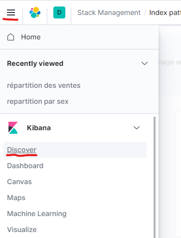

# ARCHITECTURE DE MICROSERVICE : Tracing distribué

L’objectif de ce TP est mettre en oeuvre, dans une infrastructure, le tracing distribué et la récupération de métric.

## Les éléments de notation

* fichier de configuration et images a mettre dans votre repository git

## La mise en place des composants

1. Intellj est inutile pour ce TP. aucune modification de code ne sera faite. Utilisez un terminal pour executer les commandes
2. compiler le projet du tp précédent. Le mode consul doit fonctionner.
   ```bash
   cd Infrastructure-de-production/codes
   ./mvnw clean install
   ```
3. Télécharger consul [ici](https://www.consul.io/downloads.html)
4. Installer consul, il suffit de decompresser l'archive
5. Démarrer consul
   ```bash
   ./consul agent -dev -node machine
   ```
6. Visualiser la console consul : http://localhost:8500/ui

7. SOAPUI, télécharger la version opensource, si ce n'est pas déjà fait, à l'adresse [ici](https://www.soapui.org/downloads/soapui.html)
8. Télécharger l'[agent APM elastic](https://search.maven.org/remotecontent?filepath=co/elastic/apm/elastic-apm-agent/1.19.0/elastic-apm-agent-1.19.0.jar)
9. Télécharger l'[agent APM opentelemetry](https://github.com/open-telemetry/opentelemetry-java-instrumentation/releases/download/v0.10.1/opentelemetry-javaagent-all.jar)

## fonctionnement de SOAPUI

SOAP UI est utilisé pour lancer un test de performances. il va permet de faire une scenario complet :
 - Ajout d'un propriétaire
 - Ajout d'un animal
 - Ajout d'une viste
 - Visualiser toutes les visites. cette étape doit permettre de générer une trace sur plusieurs composants.

1. lancer les composants 
   ```bash
   java --%  -jar ./spring-petclinic-visits-service/target/spring-petclinic-visits-service-2.0.4-exec.jar
   java --%  -jar ./spring-petclinic-customers-service/target/spring-petclinic-customers-service-2.0.4.jar
   ```
3. Vérification du bon fonctionnement : http://[votre host]:[port]/owners
2. lancer soapui
3. importer le [script de test](APM-soapui.xml)
    
    
1. changer les endpoints pour pointer vers ceux de votre machine. cliquez sur `APM` puis en bas a gauche sur `Custom Properties` et valoriser les deux propriétés avec vos valeurs

5. Ouvrez le testcase et lancer un test
   
   
6. Vous pouvez aussi lancer l'UI :
   ```bash
   java --%  -jar ./spring-petclinic-vets-service/target/spring-petclinic-vets-service-2.0.4.jar
   java --%  -jar ./spring-petclinic-ui/target/spring-petclinic-ui.jar
   ```
7. effectuer le même scénario avec l'ui

## Tracing distribué avec elastic APM

dans l'ordre lancer les commandes :

 1. Lancement du systeme de stokage :
   ```bash
    docker run --name elastic -p 9200:9200 -p 9300:9300 -e "discovery.type=single-node" docker.elastic.co/elasticsearch/elasticsearch:7.9.3
   ```
2. Lancement de Kibana pour la visualisation
3. Lancement du collecteur elastic
   Le fichier de configuration est [ici](apm-server.docker.yml)
   ```bash
    docker run -d --name=apm-server --user=apm-server  --volume="D:/dev/home/apm-server.docker.yml:/usr/share/apm-server/apm-server.yml:ro" -p 14268:14268 -p 14250:14250 -p 8200:8200 --link elastic:elasticsearch --link kibana:kibana  docker.elastic.co/apm/apm-server:7.9.3 --strict.perms=false -e -E output.elasticsearch.hosts=["elasticsearch:9200"]
   ```
4. lancer les composants avec l'agent elastic. Les complements de la ligne de commande sont :
   ```bash
   -javaagent:D:/dev/home/elastic-apm-agent-<version>.jar -Delastic.apm.service_name=visits-service  -Delastic.apm.server_urls=http://localhost:8200
   ```
5. lancer le test case de SOAPUI et retrouver la trace dans kibana.
   Mettre les captures d'écran correspondantes a ces traces
   - Pour avoir accès aux tableaux de bord de l'APM il faut créer l'index elastic APM
   - Pour ce faire il faut aller dans discover :

        
   - Puis cliquer sur `create index pattern`
        
        
   - Elastic vous propose tous les index crée qui sont disponibles
        
        
   - le pattern a mettre est `apm-*` 
   - Le dernier écran permet de configurer cet index avec le champs contenant le timestamp.
        
        
   - La configuration de l'index APM est fini. maintenant on peut visualiser les données 
    
        
   - Visualiser la chaine :
     - recherche de l'`petId` du `pet` de nouvelle personne créé : http://[votre host ui]:[port]/api/customer/owners. Le json retourné donne l'id du `pet`
     - http://[votre host]:[port]/api/customer/owners/*/pets/{petId}
   - Retourner dans kibana
   - Selectionnez customer-service
   - en bas de l'écran vous avez la liste de toutes les transaction :
    
   - selectionnez la transaction `PetResource#findPet`
   - Vous avez, en bas de l'ecran la trace de parcourus. 
6. lancer les composants avec l'agent opentelemetry. Les complements de la ligne de commande sont :
   ```bash
   -javaagent:D:/dev/home/opentelemetry-javaagent-all.jar -Dotel.exporter=jaeger -Dotel.exporter.jaeger.service.name=visits-service -Dotel.propagators=jaeger -Dotel.exporter.jaeger.endpoint=http://[votre host apm]:14250
   ```
    

   Pour faire fonctionner opentelemetry et elastic APM il faut configurer l'apm elastic pour accepter des requetes de type jaeger. ce qui est fait via le fichier de configuration passé en parametre lors du lancement de l'apm.
7. lancer le test case de SOAPUI et retrouver la trace dans kibana.
   Mettre les captures d'écran correspondantes a ces traces
   Quelles sont les différences entre les deux approches ?

## Tracing distribué avec jaegger

Le fonctionnement de jaeger, dans notre configuration, est un le même que de celui de elastic


ici on est sur un découpage a quatre étages possibles. Dans notre configuration on va en utiliser que 2 :
- l'agent d'instrumentation sur l'application envoie les informations au collector
- Le collector recoit les informations et les stock que la base sélecitonnée

1. Lancement du systeme de stokage :
   ```bash
    docker run --name elastic -p 9200:9200 -p 9300:9300 -e "discovery.type=single-node" docker.elastic.co/elasticsearch/elasticsearch:7.9.3
2. Lancement du collecteur jaeger
   ```bash
    docker run -d --rm --name=jaeger-collector \
                        -p4267:4267 -p14250:14250 -p14268:14268 -p9411:9411 -p14269:14269 \ 
                        --link elastic:elasticsearch \ 
                        -e SPAN_STORAGE_TYPE=elasticsearch \ 
                        -e ES_SERVER_URLS=http://elasticsearch:9200   \ 
                        jaegertracing/jaeger-collector:1.16
   ```
3. Lancement de l'ui
   ```bash
   docker run -d --rm --name=jaeger-ui \
                        -p 16686:16686 -p 16687:16687 \
                        --link elastic:elasticsearch  \
                        -e SPAN_STORAGE_TYPE=elasticsearch \
                        -e ES_SERVER_URLS=http://elasticsearch:9200  \
                        jaegertracing/jaeger-query:1.16
   ```
4. lancer les composants avec l'agent opentelemetry. Les complements de la ligne de commande sont :
   ```bash
   -javaagent:D:/dev/home/opentelemetry-javaagent-all.jar -Dotel.exporter=jaeger -Dotel.exporter.jaeger.service.name=visits-service -Dotel.propagators=jaeger -Dotel.exporter.jaeger.endpoint=http://[votre host apm]:14250
   ```
5. lancer le test case de SOAPUI et retrouver la trace dans l'ui jaegger.
   Mettre les captures d'écran correspondantes a ces traces
    